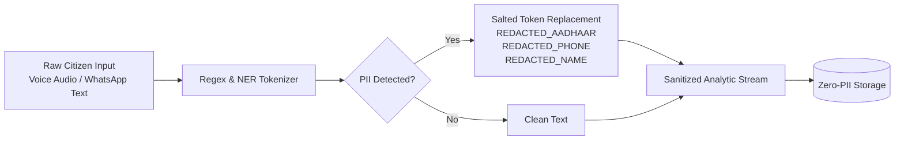

# Technical Architecture Specification
## JANA-GATISHAKTI / CIVIC-PULSE BRICS DPI Platform

---

### 1. Mathematical Formulations

#### 1.1. Demand-Deficit Disparity Index (DDDI)
To surface acute, unaddressed demand hotspots, the system synthesizes citizen distress signals with official infrastructure deficit metrics and demographic vulnerability:

$$\text{DDDI}(r, s) = w_d \cdot D(r, s) + w_i \cdot I(r, s) + w_v \cdot V(r)$$

Where:
* $r$ is the administrative region (District, Sub-division, Gram Panchayat).
* $s$ is the infrastructure sector ($s \in \{\text{Water, Power, Roads, Health, Telecom, Sanitation}\}$).
* $D(r, s)$ is the normalized citizen demand intensity score:
  $$D(r, s) = \min\left(100, N_{\text{requests}} \times 15.0 + C_{\text{total}} \times 0.4 \times \frac{\bar{S}}{5.0}\right)$$
  with $N_{\text{requests}}$ = count of requests, $C_{\text{total}}$ = corroborated upvotes, and $\bar{S}$ = average severity (1–5).
* $I(r, s)$ is the official sector deficit index ($0 \le I \le 100$) from sovereign registries.
* $V(r)$ is the composite socioeconomic vulnerability index:
  $$V(r) = 0.50 \cdot P_{\text{poverty}} + 0.30 \cdot P_{\text{tribal}} + 0.20 \cdot P_{\text{rural}}$$
* Policy weights: $w_d = 0.40, w_i = 0.35, w_v = 0.25$ (sum = 1.0).

#### 1.2. Multi-Criteria Decision Analysis (MCDA) Project Prioritization
Each demand hotspot is translated into a discrete, bankable capital project proposal. The project's priority score is computed as:

$$\text{MCDA\_Score} = 0.40 \cdot \text{DDDI} + 0.25 \cdot V(r) + 0.20 \cdot (\mu_{\text{SDG}} \times 50) + 0.15 \cdot E_{\text{capex}}$$

Where:
* $\mu_{\text{SDG}}$ is the sector's SDG impact multiplier (e.g. 1.45 for Water, 1.50 for Healthcare, 1.40 for Roads).
* $E_{\text{capex}}$ is the capex efficiency score:
  $$E_{\text{capex}} = \max\left(10, \min\left(100, 100 - \frac{\text{Capex (INR)}}{\text{Beneficiaries}} \times 5000\right)\right)$$

---

### 2. Zero-Knowledge PII Sanitization Pipeline (DPGA Indicators 6 & 7)

* **Indian Aadhaar**: `\b[2-9]{1}[0-9]{3}\s?[0-9]{4}\s?[0-9]{4}\b` $\rightarrow$ `[REDACTED_AADHAAR]`
* **Indian Mobile**: `(\+91[\-\s]?)?[6-9]\d{9}\b` $\rightarrow$ `[REDACTED_PHONE]`
* **Brazilian CPF**: `\b\d{3}\.\d{3}\.\d{3}\-\d{2}\b` $\rightarrow$ `[REDACTED_CPF]`
* **South African ID**: `\b\d{13}\b` $\rightarrow$ `[REDACTED_NATIONAL_ID]`
* **Personal Names**: Declared vernacular name patterns $\rightarrow$ `[REDACTED_CITIZEN_NAME]`

---

### 3. Open Standards Implementation

* **OGC GeoJSON (RFC 7946)**: Hotspots and capital projects are serialized into standardized `FeatureCollection` objects containing geospatial coordinates, boundary buffers, and disparity properties.
* **Open Contracting Data Standard (OCDS 1.1)**: Every generated capital project dossier conforms to the OCDS release schema, linking planning budgets, project tags, and delivery addresses to facilitate transparent public procurement.
