# JANA-GATISHAKTI (जन-गतिशक्ति) | BRICS CIVIC-PULSE
### A Sovereign Digital Public Good (DPG) for Multilingual Citizen Voice Aggregation, Spatial Need Hotspots & Capital Project Formulation

[](https://digitalpublicgoods.net/standard/)
[](https://opensource.org/licenses/Apache-2.0)
[](#)
[](https://python.org)

---

## 1. Executive Summary & The Problem

Governments across developing and emerging economies—particularly across the **BRICS+ coalition** (Brazil, Russia, India, China, South Africa, Egypt, Ethiopia, Iran, Saudi Arabia, UAE)—invest upwards of **\$3.2 Trillion annually** in public infrastructure. However, up to **30%–40% of public infrastructure investment is misaligned**, suffering from three structural failures:

1. **Fragmented Citizen Feedback**: Citizen grievances live in departmental silos (toll-free IVR voice lines, local ward complaint logs, WhatsApp groups, SMS, and paper petitions).
2. **The "Ticketing" Illusion**: Current platforms like India's CPGRAMS treat complaints merely as *individual grievance tickets* to be marked "resolved" or forwarded, with **zero linkage to capital expenditure (Capex) allocation or GIS infrastructure planning**.
3. **Top-Down Infrastructure Blind Spots**: National master plans (such as India's PM GatiShakti) successfully integrate 58+ ministry GIS layers (rail corridors, highways, pipelines), but possess **no bottom-up citizen demand verification layer**. This leads to "ghost infrastructure" (e.g. water tanks built with no pipeline, schools built without toilets) while acute community crises go unaddressed.

---

## 2. The Breakthrough Innovation: The "Citizen-Up" GatiShakti

**Jana-GatiShakti** bridges the chasm between **CPGRAMS (Citizen Grievance Redressal)** and **PM GatiShakti (National Infrastructure Planning)**:

```
┌─────────────────────────────────┐       ┌─────────────────────────────────┐
│       CPGRAMS / CM Helpline     │       │       PM GatiShakti / PAC       │
│  (Isolated Ticket Complaints)   │       │   (Top-Down Highway Planning)   │
└────────────────┬────────────────┘       └────────────────┬────────────────┘
                 │                                         │
                 ▼                                         ▼
         ┌────────────────────────────────────────────────────────┐
         │             JANA-GATISHAKTI DPI PLATFORM              │
         │  • Zero-Knowledge PII Redaction (DPGA 6 & 7)           │
         │  • Vernacular Speech-to-Intent (Project Vaani Model)  │
         │  • 4-Layer Geospatial Data Fusion Grid                 │
         │  • Spatial Hotspot & Demand-Deficit Disparity Index    │
         │  • MCDA-Powered Bankable Project DPR Generator         │
         │  • Jan-Praman Ghost Asset Sentinel (Closed Loop)       │
         └───────────────────────────┬────────────────────────────┘
                                     │
                                     ▼
         ┌────────────────────────────────────────────────────────┐
         │       PRIORITIZED SOVEREIGN CAPITAL PROJECTS           │
         │  (JJM Water, PMGSY Roads, PM-KUSUM, Ayushman Bharat)  │
         └────────────────────────────────────────────────────────┘
```

---

## 3. High-Level System Architecture

```mermaid
flowchart TD
    subgraph Ingestion ["1. Vernacular Citizen Channels (Bhasha-Setu)"]
        IVR["🎙️ Voice IVR / Phone Calls"]
        WA["💬 WhatsApp / Telegram Bots"]
        GPK["🏛️ Gram Panchayat Kiosk"]
        PWA["📱 Web / Mobile Portal"]
    end

    subgraph Trust ["2. DPG Privacy & Trust Layer"]
        PII["🛡️ Zero-Knowledge PII Scrubber (Aadhaar/CPF/Phone/Name Redaction)"]
        DEDUP["🔄 Semantic De-duplication & Corroboration Engine"]
    end

    subgraph AI_Core ["3. Multilingual NLP & Geospatial Fusion"]
        NLP["🤖 Speech-to-Text & Dialect Normalization (6+ Languages)"]
        SEC["📊 Sector & Urgency Classifier (Water, Power, Roads, Health)"]
        FUS["🌐 4-Layer Fusion: Feedback + Demographics + Indices + Capex"]
    end

    subgraph Analytics ["4. Spatial Hotspots & MCDA Prioritization"]
        HOT["📍 Spatial Need Hotspot Discovery (H3 Hexagonal Clustering)"]
        BLIND["🚨 Government Blind Spot Detector"]
        MCDA["🏛️ MCDA Project Recommender (Bankable DPR Dossiers)"]
    end

    subgraph Delivery ["5. Policymaker Cockpit & Impact Loop"]
        MAP["🗺️ Interactive GIS Map & Choropleth Overlays"]
        SIM["📈 Capex What-If Scenario Simulator"]
        OCDS["📑 Open Contracting Data Standard (OCDS) / GeoJSON"]
        AUD["🔍 Jan-Praman: Ghost Asset Sentinel & Verification Calls"]
    end

    Ingestion --> Trust
    Trust --> AI_Core
    AI_Core --> Analytics
    Analytics --> Delivery
```



---

## 4. Key Differentiators (Why This Wins at Google Hackathons)

### A. Google AI & Sovereign DPI Synergy
* **Project Vaani Integration**: Built to leverage open speech datasets spanning 773 Indian districts and 80+ vernacular dialects (Hindi, Marathi, Tamil, Telugu, Kannada, Bengali).
* **Multimodal Vision & Audio Understanding**: Incorporates zero-knowledge PII sanitization before feature extraction, ensuring complete privacy compliance (DPDP Act 2023 & LGPD).
* **Dual-Lens Ground-to-Orbit Cross-Verification**: Citizen voice reports on dry reservoirs or flood-damaged roads can be cross-verified against open Earth Observation indices (NDWI surface water index, nighttime lights VIIRS for grid outages).

### B. "Nivesh-Drishti" Capital Project Dossier Generator
Rather than dumping thousands of raw tickets on administrators, the system uses **Multi-Criteria Decision Analysis (MCDA)** to synthesize **Bankable Project Dossiers**:
* Projected Capex in local currency (₹ Crores) and USD.
* Primary SDG tagging (SDG 3, 6, 7, 9, 10, 11).
* Mapped to active sovereign schemes (**Jal Jeevan Mission, PMGSY, PM-KUSUM, Ayushman Bharat, BharatNet**).
* Quantifiable Beneficiary Reach & Cost-per-Beneficiary efficiency metric.

### C. "Jan-Praman" Closed-Loop Ghost Asset Sentinel
Solves the endemic crisis of paper-only project completions. The platform automatically triggers automated follow-up voice calls to original complainants upon project sign-off (*"Is the water flowing through your new tap?"*). If citizen feedback indicates non-functionality, a **Critical Ghost Asset Alert** is dispatched to vigilance authorities.

---

## 5. Digital Public Goods Alliance (DPGA) Compliance Matrix

| DPGA Indicator | How JANA-GATISHAKTI Complies | Verification API |
|---|---|---|
| **1. SDG Relevance** | Directly targets SDGs 3, 6, 7, 9, 10, 11, 16 with quantifiable impact indicators. | `/api/dpg/compliance` |
| **2. Open Licencing** | Released under **Apache 2.0 License** for sovereign adoption without vendor lock-in. | `LICENSE` file |
| **3. Clear Ownership** | Developed by the Citizen-DPI Open Source Consortium. | `README.md` |
| **4. Platform Independence** | Containerized with Docker; runs on bare-metal Linux, sovereign cloud, or standard PCs. | `Dockerfile`, `docker-compose.yml` |
| **5. Documentation** | Complete OpenAPI 3.0 documentation, architecture guides, and API specs. | `/docs` (Swagger UI) |
| **6. Non-PII Extraction** | Built-in regex and token zero-knowledge scrubber strips Aadhaar, CPF, phone numbers, and names before persistence. | `/api/feedback/submit` |
| **7. Privacy & Applicable Laws** | Built from the ground up to comply with India DPDP Act 2023, Brazil LGPD, and South Africa POPIA. | `/api/dpg/compliance` |
| **8. Open Standards** | Implements OGC GeoJSON for spatial polygons and Open Contracting Data Standard (OCDS) for project budgets. | `/api/dpg/geojson`, `/api/dpg/ocds` |
| **9. Do No Harm by Design** | Algorithmic fairness guardrails; toxic content filter; community consensus verification to prevent harassment. | `/api/dpg/compliance` |

---

## 6. Directory Structure

```
d:\Hackathon\
├── backend/
│   ├── data/
│   │   ├── sovereign_data.py       # Calibrated demographics & deficit indices (India + BRICS)
│   │   └── citizen_requests.py     # Authentic multilingual citizen voice datasets
│   ├── services/
│   │   ├── nlp_engine.py           # Vernacular NLP, language detection & zero-knowledge PII scrubber
│   │   ├── hotspot_engine.py       # Spatial clustering & Demand-Deficit Disparity Index (DDDI)
│   │   ├── mcda_recommender.py     # Multi-Criteria Decision Analysis project formulation engine
│   │   ├── impact_tracker.py       # Closed-loop audit, budget simulator & ghost asset sentinel
│   │   └── store.py                # Live state management, OCDS & GeoJSON export interfaces
│   └── main.py                     # FastAPI REST API server
├── frontend/
│   ├── static/
│   │   ├── app.js                  # Frontend Leaflet controller, Web Speech API & simulator logic
│   │   └── styles.css              # Custom glassmorphic styling & responsive layouts
│   └── index.html                  # Single-page sovereign GIS command cockpit & citizen kiosk
├── docs/
│   ├── ARCHITECTURE.md             # Detailed technical architecture specification
│   ├── DPGA_COMPLIANCE.md          # 9 DPGA indicators formal audit dossier
│   └── GOOGLE_INNOVATION_STRATEGY.md # Unique differentiation & Google AI synergy strategy
├── scripts/
│   ├── run_server.bat              # Windows batch launcher
│   ├── run_server.ps1              # Windows PowerShell launcher
│   └── run_tests.ps1               # Automated test suite runner
├── tests/
│   └── test_backend.py             # 5 core integration & unit tests
├── .gitattributes                  # Normalizes line endings across platforms
├── .gitignore                      # Python, OS, and IDE ignore rules
├── Dockerfile                      # DPG sovereign container build
├── docker-compose.yml              # Local multi-service orchestrator
├── LICENSE                         # Apache-2.0 Open Source License
├── PREREQUISITES.md                # System prerequisites and installation steps
├── requirements.txt                # Pinned pip dependencies
└── README.md                       # Master project overview
```

---

## 7. Quickstart Guide

### Prerequisites
* Python 3.10+ (Tested on Python 3.12 & 3.14)
* pip
* Git
* Modern web browser (Chrome, Edge, Firefox)

### Step 1: Install Dependencies
```bash
python -m pip install -r requirements.txt
```

### Step 2: Run Automated Tests
```bash
python tests/test_backend.py
```

### Step 3: Launch Sovereign Platform
```bash
python -m uvicorn backend.main:app --host 127.0.0.1 --port 8000 --reload
```
Or simply run on Windows:
```powershell
.\scripts\run_server.ps1
```

### Step 4: Open Interactive Web Cockpit
Navigate your browser to:
👉 **[http://127.0.0.1:8000](http://127.0.0.1:8000)**

---

## 8. Interactive Features Walkthrough

1. **Bhasha-Setu Citizen Kiosk**:
   - Click one of the 1-Click preset citizen scenarios (e.g. *Vidarbha Water & Health in Marathi*, *Bastar Tribal Road in Hindi*, *Raichur Fluoride Water in Kannada*, *Nuh Girls School in Hindi*, or *Bahia Cisterna in Portuguese*).
   - Alternatively, click **"🎙️ Speak in Vernacular"** to dictate your own request using browser Speech Recognition.
   - Notice the instant **Zero-Knowledge PII Sanitization** (phone numbers and Aadhaar/CPF IDs are scrubbed on the fly).
   - Click **"Ingest & Cluster"**: The backend updates the geospatial grid, recalculates the Demand-Deficit Disparity Index, and automatically pans the Leaflet GIS map to the new hotspot!

2. **Geospatial GIS Command Cockpit**:
   - Filter hotspots by sector (**💧 Water, 🛣️ Roads, ⚡ Power, 🏥 Health, 📶 Telecom, 🚽 Sanitation**).
   - Click any circular hotspot marker to view affected population, corroborated citizen testimonies, and the **Government Blind Spot Alert**.
   - Click **"Formulate Capital Project Dossier"** to open a bankable project memorandum.

3. **Capex Allocation & What-If Policy Simulator**:
   - Adjust the **Total District Budget** slider (₹ 30 Cr to ₹ 300 Cr).
   - Slide sector allocation percentages (Water, Roads, Power, Health, Telecom, Sanitation).
   - Observe real-time algorithmic projections of **Hotspots Resolved**, **Citizens Reached**, **Regional Deficit Reduction %**, and **Citizen Satisfaction Surge %**.

4. **Jan-Praman Ghost Asset Sentinel**:
   - Review live citizen post-completion verification audits.
   - Observe red **Discrepancy Alerts** flagging projects where contractor invoices were paid, but citizen phone surveys reveal broken or non-existent assets.

5. **Open Standards & DPG Exports**:
   - Open Contracting Data Standard (OCDS) releases: `/api/dpg/ocds`
   - OGC GeoJSON feature collection: `/api/dpg/geojson`
   - DPGA 9-Indicator compliance audit: `/api/dpg/compliance`

---

## 9. License

This project is licensed under the **Apache License, Version 2.0** in full compliance with the Digital Public Goods Alliance open source standards. See the [LICENSE](LICENSE) file for details.
